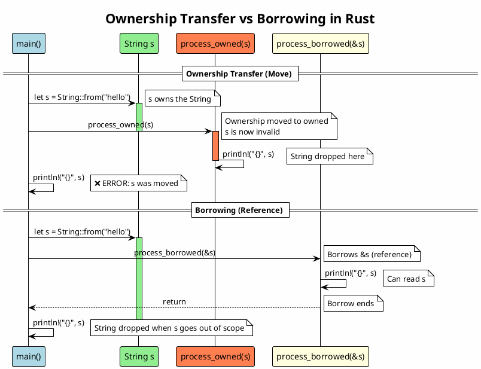
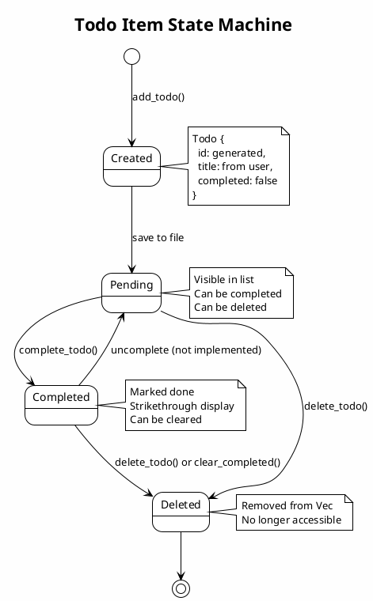
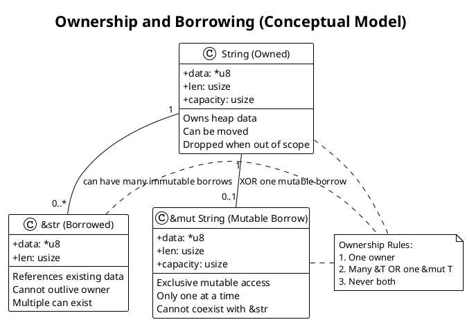
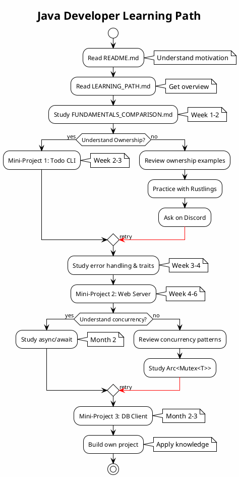

# Architecture Diagrams

This document contains C4 model diagrams for the language-specific tracks and mini-projects.

---

## System Context Diagram - Language-Specific Learning Tracks

```plantuml
@startuml
!include https://raw.githubusercontent.com/plantuml-stdlib/C4-PlantUML/master/C4_Context.puml

LAYOUT_WITH_LEGEND()

title System Context - Rust Learning Lab Language Tracks

Person(javaDev, "Java Developer", "Backend engineer familiar with Spring/Jakarta EE")
Person(pythonDev, "Python Developer", "Data scientist or web developer using Django/Flask")
Person(goDev, "Go Developer", "Systems programmer using Go for microservices")

System(rustLab, "Rust Learning Lab", "Comprehensive Rust learning platform with language-specific tracks")

System_Ext(rustBook, "The Rust Book", "Official Rust documentation")
System_Ext(rustDocs, "docs.rs", "Rust crate documentation")
System_Ext(rustPlayground, "Rust Playground", "Online Rust compiler")

Rel(javaDev, rustLab, "Learns Rust", "Java Track")
Rel(pythonDev, rustLab, "Learns Rust", "Python Track")
Rel(goDev, rustLab, "Learns Rust", "Go Track")

Rel(rustLab, rustBook, "References")
Rel(rustLab, rustDocs, "Links to")
Rel(javaDev, rustPlayground, "Experiments with code")
Rel(pythonDev, rustPlayground, "Experiments with code")
Rel(goDev, rustPlayground, "Experiments with code")

@enduml
```

---

## Container Diagram - Java Track Architecture

```plantuml
@startuml
!include https://raw.githubusercontent.com/plantuml-stdlib/C4-PlantUML/master/C4_Container.puml

LAYOUT_WITH_LEGEND()

title Container Diagram - Java Developer Track

Person(javaDev, "Java Developer", "Learning Rust")

System_Boundary(javaTrack, "Java Developer Track") {
    Container(learningPath, "Learning Path", "Markdown", "Progressive curriculum")
    Container(fundamentals, "Fundamentals Comparison", "Markdown + Code", "Java vs Rust concepts")
    Container(patterns, "Design Patterns", "Markdown + Code", "GoF patterns in Rust")
    Container(antiPatterns, "Anti-Patterns", "Markdown + Code", "Common mistakes")
    Container(cheatSheet, "Cheat Sheet", "Markdown", "Quick reference")
    Container(miniProjects, "Mini-Projects", "Rust Projects", "Hands-on practice")
}

Container_Boundary(miniProjectDetail, "Mini-Projects") {
    Container(todoCli, "Todo CLI", "Cargo Project", "Ownership + basics")
    Container(webServer, "Web Server", "Cargo Project", "Concurrency")
    Container(dbClient, "DB Client", "Cargo Project", "Async/await")
}

Rel(javaDev, learningPath, "Starts with", "Read")
Rel(learningPath, fundamentals, "References")
Rel(javaDev, fundamentals, "Studies", "Side-by-side code")
Rel(fundamentals, patterns, "Leads to")
Rel(javaDev, patterns, "Learns", "Pattern translation")
Rel(javaDev, antiPatterns, "Avoids mistakes")
Rel(javaDev, cheatSheet, "Quick lookup")
Rel(learningPath, miniProjects, "Practice with")

Rel(javaDev, todoCli, "Builds", "Week 1-2")
Rel(javaDev, webServer, "Builds", "Week 3-4")
Rel(javaDev, dbClient, "Builds", "Month 2-3")

@enduml
```

---

## Component Diagram - Todo CLI Application

```plantuml
@startuml
!include https://raw.githubusercontent.com/plantuml-stdlib/C4-PlantUML/master/C4_Component.puml

LAYOUT_WITH_LEGEND()

title Component Diagram - Todo CLI Application

Person(user, "Developer")

Container_Boundary(todoCli, "Todo CLI Application") {
    Component(main, "main.rs", "Binary", "CLI entry point\nParses commands")
    Component(lib, "lib.rs", "Library", "Public API")
    Component(todoApp, "TodoApp", "Struct", "Application state\nBusiness logic")
    Component(todo, "Todo", "Struct", "Data model")
    Component(storage, "Storage Functions", "Module", "JSON persistence")

    ComponentDb(jsonFile, "todos.json", "JSON", "Persisted data")
}

System_Ext(clap, "clap crate", "CLI argument parsing")
System_Ext(serde, "serde crate", "Serialization")

Rel(user, main, "Executes", "cargo run")
Rel(main, clap, "Uses", "Parse args")
Rel(main, todoApp, "Creates/loads")
Rel(todoApp, todo, "Contains Vec<Todo>")
Rel(todoApp, storage, "save()/load()")
Rel(storage, serde, "Uses", "JSON ser/de")
Rel(storage, jsonFile, "Reads/writes")

@enduml
```

---

## Component Diagram - Multithreaded Web Server

```plantuml
@startuml
!include https://raw.githubusercontent.com/plantuml-stdlib/C4-PlantUML/master/C4_Component.puml

LAYOUT_WITH_LEGEND()

title Component Diagram - Multithreaded Web Server

Person(client, "HTTP Client")

Container_Boundary(webServer, "Web Server") {
    Component(listener, "TCP Listener", "Main Thread", "Accepts connections")
    Component(threadPool, "Thread Pool", "Workers", "Processes requests")
    Component(router, "Router", "Component", "Routes requests")
    Component(handlers, "Handlers", "Component", "Request handlers")
    Component(counter, "Connection Counter", "Arc<Mutex>", "Thread-safe state")

    Component(worker1, "Worker 1", "Thread", "Request processor")
    Component(worker2, "Worker 2", "Thread", "Request processor")
    Component(worker3, "Worker 3", "Thread", "Request processor")
    Component(worker4, "Worker 4", "Thread", "Request processor")

    ComponentQueue(channel, "mpsc::channel", "Queue", "Job queue")
}

Rel(client, listener, "Connects", "TCP")
Rel(listener, channel, "Sends job")
Rel(channel, worker1, "Receives")
Rel(channel, worker2, "Receives")
Rel(channel, worker3, "Receives")
Rel(channel, worker4, "Receives")
Rel(worker1, router, "Parses request")
Rel(worker2, router, "Parses request")
Rel(worker3, router, "Parses request")
Rel(worker4, router, "Parses request")
Rel(router, handlers, "Dispatches")
Rel(handlers, counter, "Increments")

@enduml
```

---

## Sequence Diagram - Ownership and Borrowing



---

## Deployment Diagram - Language Track Comparison

```plantuml
@startuml
!include https://raw.githubusercontent.com/plantuml-stdlib/C4-PlantUML/master/C4_Deployment.puml

LAYOUT_WITH_LEGEND()

title Deployment Comparison - Same App in Different Languages

Deployment_Node(javaServer, "Java Server", "Ubuntu 22.04") {
    Deployment_Node(jvm, "JVM", "OpenJDK 17") {
        Container(javaApp, "Spring Boot App", "JAR", "Memory: 150MB\nStartup: 2s")
    }
}

Deployment_Node(pythonServer, "Python Server", "Ubuntu 22.04") {
    Deployment_Node(pythonRuntime, "Python Runtime", "Python 3.11") {
        Container(pythonApp, "FastAPI App", "Python", "Memory: 50MB\nStartup: 0.5s")
    }
}

Deployment_Node(goServer, "Go Server", "Ubuntu 22.04") {
    Container(goApp, "Go App", "Binary", "Memory: 20MB\nStartup: 0.05s\nNo runtime needed")
}

Deployment_Node(rustServer, "Rust Server", "Ubuntu 22.04") {
    Container(rustApp, "Rust App", "Binary", "Memory: 5MB\nStartup: 0.01s\nNo runtime needed")
}

Deployment_Node(loadBalancer, "Load Balancer", "nginx") {
    Container(nginx, "nginx", "Reverse Proxy", "Routes traffic")
}

Rel(nginx, javaApp, "Forwards", "HTTP")
Rel(nginx, pythonApp, "Forwards", "HTTP")
Rel(nginx, goApp, "Forwards", "HTTP")
Rel(nginx, rustApp, "Forwards", "HTTP")

@enduml
```

---

## State Machine Diagram - Todo Lifecycle



---

## Class Diagram - Rust Ownership Model (Conceptual)



---

## Activity Diagram - Learning Path Flow



---

## How to Use These Diagrams

### Rendering PlantUML

**Online**:
- Copy diagram code to [PlantUML Online Editor](http://www.plantuml.com/plantuml/uml/)
- Download as PNG/SVG

**VS Code**:
```bash
# Install extension
code --install-extension jebbs.plantuml

# Or use PlantUML Preview extension
```

**Command Line**:
```bash
# Install PlantUML
brew install plantuml  # macOS
apt install plantuml   # Ubuntu

# Render
plantuml diagram.puml
```

### Integration with Documentation

Include rendered diagrams in markdown:

```markdown
## Architecture


The system consists of three main tracks...
```

---

## Color Coding Standards

### C4 Diagrams

- **Person**: `#08427B` (Blue)
- **System**: `#1168BD` (Light Blue)
- **Container**: `#438DD5` (Sky Blue)
- **Component**: `#85BBF0` (Pale Blue)
- **External System**: `#999999` (Gray)

### State/Sequence Diagrams

- **Created State**: `#LightGreen`
- **Processing**: `#LightYellow`
- **Completed**: `#LightBlue`
- **Error/Deleted**: `#Coral`

### Ownership Diagrams

- **Owned Type**: `#90EE90` (Light Green)
- **Borrowed (&T)**: `#FFD700` (Gold)
- **Mutable Borrow (&mut T)**: `#FF6347` (Tomato)

---

**Next Steps**: Add these diagrams to relevant documentation files and README sections.
